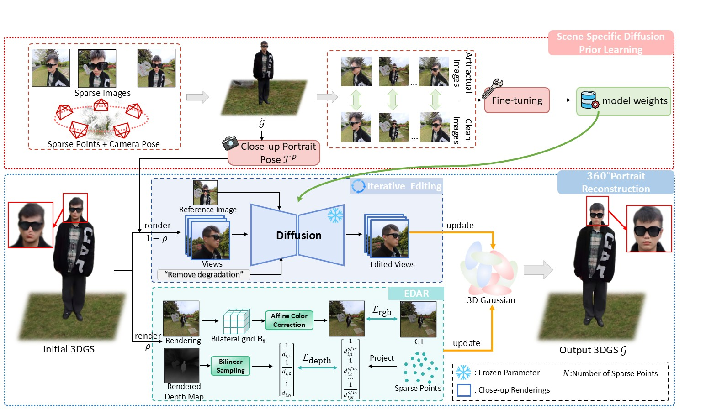
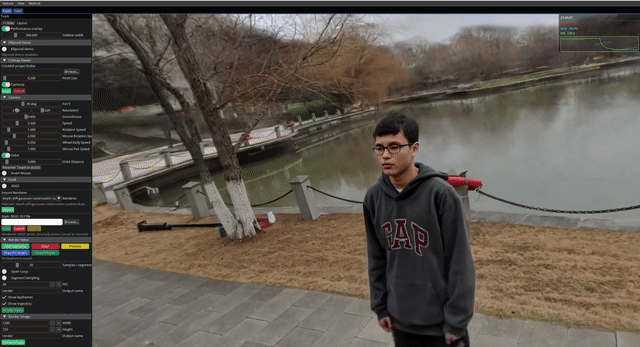
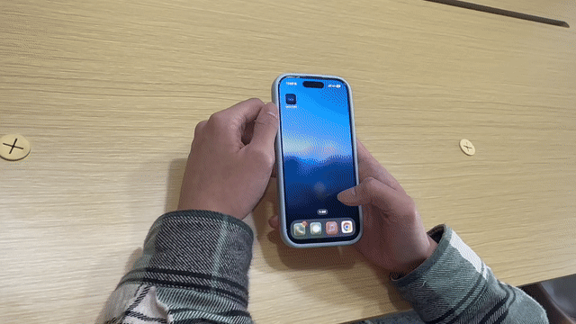
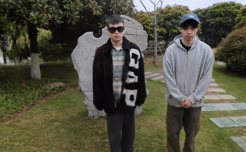

  <h1>Person360: Diffusion-Guided 3D Gaussian Splatting   for Static 360-Degree Portrait Reconstruction</h1>

  **Cunqi Wu** · **Minhao Lin** · **Jianchao Wang** · **Peng Zhou** · **Jie Qin**

  College of Artificial Intelligence, Nanjing University of Aeronautics and Astronautics

  

  

 ## TODOs

[ ] Clean up the code and release it as open source.

## Method

Person360 uses a scene-specific diffusion prior to restore portrait details during 3D Gaussian Splatting optimization. Its iterative render-edit-refresh strategy updates close-up supervision as the reconstruction evolves, while bilateral-grid appearance correction and SfM-anchored sparse depth regularization help reduce appearance drift and stabilize geometry.

  

## Software

  <h4>Interactive Viewer Demos</h4>
  

    

      <h4>Desktop Software</h4>
      
    

    

      <h4>Mobile App</h4>
      
    

  

## Render comparisons

Qualitative render comparisons on 360-degree portrait scenes. The clips below show Person360 alongside a static reconstruction baseline and a dynamic reconstruction baseline.

### Static Method Comparison

  
   
  
  

### Dynamic Method Comparison

  
   
  
  

